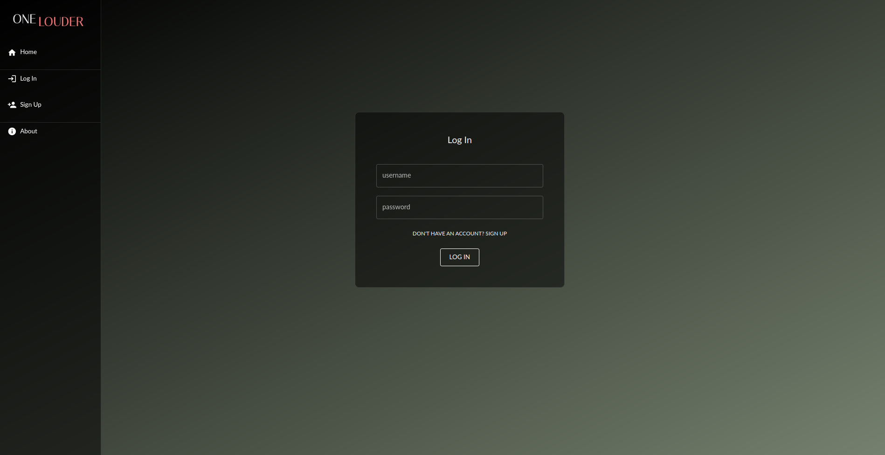
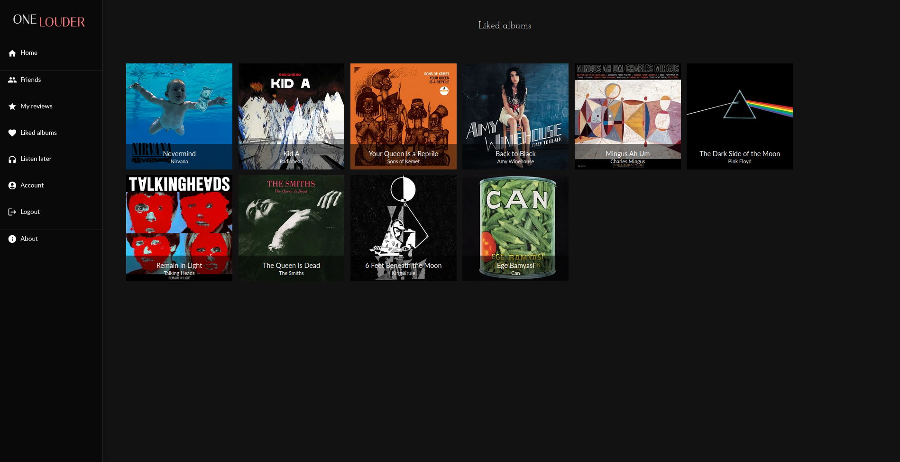
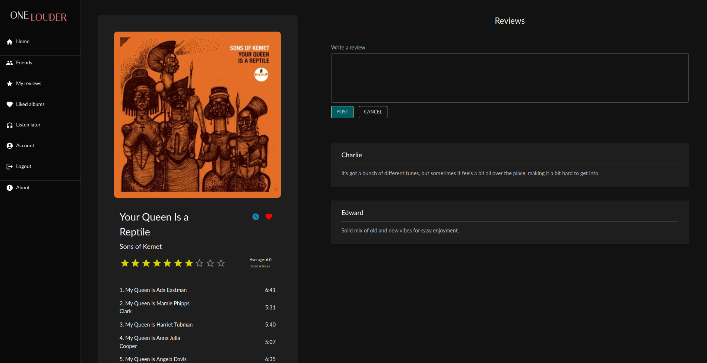

This project was developped as part of the Web Application Project (iti0302) course in Taltech.

## OneLouder

#### Introduction

A music app designed for enthusiasts who want a straightforward way to manage their music preferences.

#### Author

- Morten Tšinakov

#### Technologies Used

- Java 17+
- Spring Boot 3.1.3
- PostgreSQL 16.0
- MapStruct 1.5.5
- Spring Security 6.2.0
- Liquibase 4.25.0
- Lombok 1.18.30
- Jjwt 0.11.5
- OpenApi 2.1.0

#### Setting up the development environment

1. Clone the project
2. Create a docker compose file for the database (name it docker-compose.yml for example): <br>
```yaml
services:
  postgres:
    container_name: postgres_container
    image: postgres
    environment:
      - POSTGRES_USER=postgres
      - POSTGRES_PASSWORD=docker
    volumes:
      - ./postgres-data:/var/lib/postgresql/data
    ports:
      - "5432:5432"
```
3. Create an application.properties file for development in src/main/resources: <br>
```properties
spring.datasource.url=jdbc:postgresql://localhost:5432/postgres
spring.datasource.username=postgres
spring.datasource.password=docker
spring.datasource.driver-class-name=org.postgresql.Driver

spring.liquibase.change-log=classpath:/db/changelog/changelog-master.xml

external.api.key = <external_api_key>
jwt.secret.key = JdLE5TJpQf2bt9duhHYdjcaUZToux9i8i64yvhJKXLbm8cX7bn
```
4. Run ```docker compose up``` command from where the compose file for database is located
5. Run the project from your IDE or with ```./gradlew bootRun``` command (from the directory where 'gradlew' file is located)

PS! For the album search function to work you have to add to application.properties (external.api.key variable):
- Last.fm API key (can be created on last.fm website).

Without Last.fm API key the album search function doesn't work and fetching album info works only if the album is already in the database.
Some initial data is added to the database when first running the program, so it's possible to get a feel of the app even without registering an API key (it's better with the search function, though, so registering the API key is recommended). You can log in using those credentials:
- username: test
- password: password

#### Screenshots of the app

<div style="display:flex; justify-content: space-between;">
    
    
    
</div>

